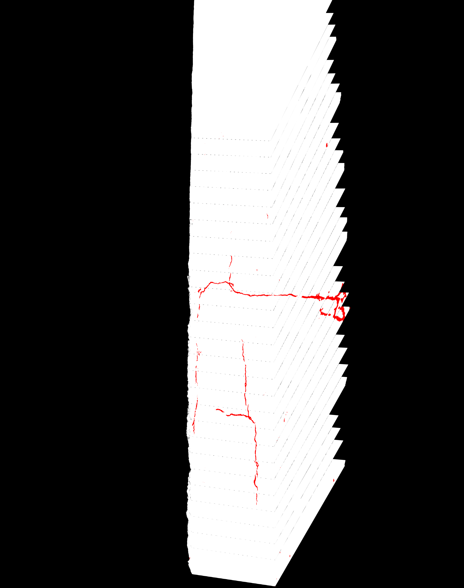
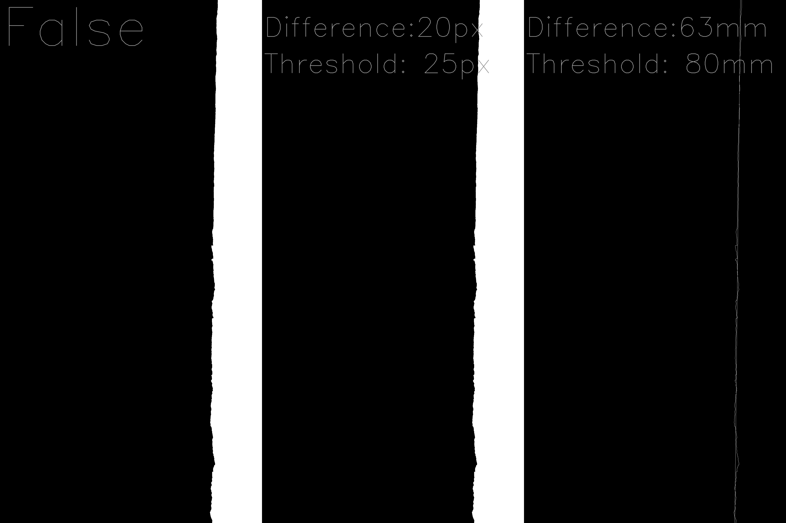
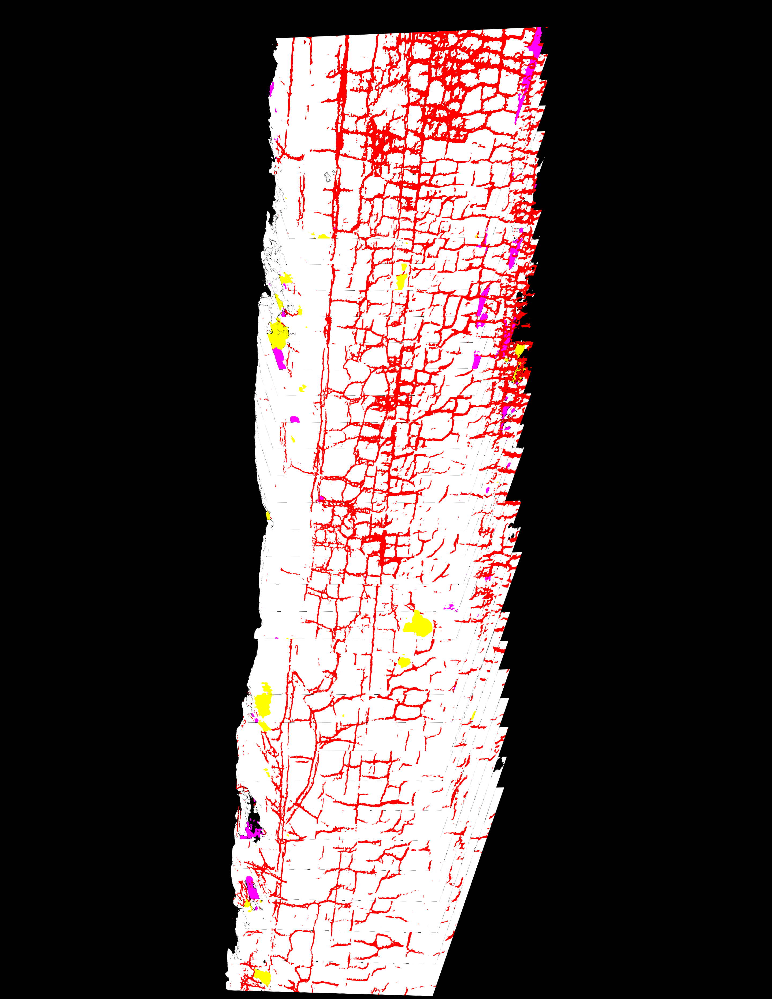
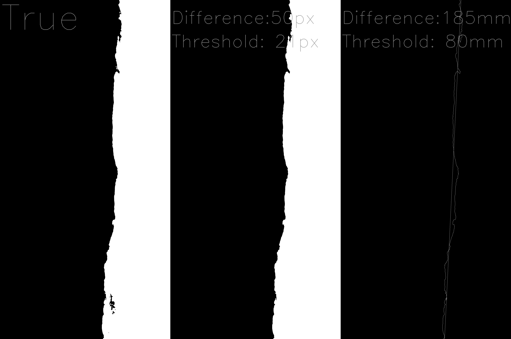

# Road Edge Deterioration Detector

This Python-based project leverages OpenCV to detect edge deterioration in road images. The program takes as input stitched images of roads along with their corresponding inference masks. It then performs an analysis to determine if the road edges are deteriorated.

## Table of Contents

- [Introduction](#introduction)
- [Features](#features)
- [Installation](#installation)
- [Usage](#usage)
- [Examples](#examples)


## Introduction

Road maintenance is crucial for ensuring safety and prolonging the lifespan of road infrastructure. This project aims to automate the detection of road edge deterioration using computer vision techniques. By analyzing stitched road images and their corresponding inference masks, the system can identify areas where the road edges have deteriorated.

## Features

- **Image Stitching:** Combines multiple images of road sections into a single, coherent image.
- **Inference Mask Utilization:** Uses pre-generated inference masks to assist in the analysis.
- **Edge Detection:** Implements advanced edge detection algorithms to identify road edges.
- **Deterioration Analysis:** Analyzes the detected edges to determine the presence of deterioration.
- **Visualization:** Provides visual outputs highlighting the deteriorated areas.

## Installation

To get started with the Road Edge Deterioration Detector, follow these steps:

1.**Clone the Repository:**
```
https://github.com/Umar-Farooq-2112/RoadGaugeTasks.git
```
Navigate to "1. Road Edge Deterioration Detector/edge_deterioration_detector.py"
<br>
2.**Install Dependencies (if any):**
```
pip install opencv-python
```

## Usage

To use the Road Edge Deterioration Detector, follow these steps:

1. **Prepare your input images and inference masks.**
2. **Run the detection script.**
3. **View the results:**
    The Script with return pair of booleans sjowing of deterioration was observed on left and right side of road.
## Examples

Here are some example usages of the Road Edge Deterioration Detector:

|  |  |
|:------------------------------------------:|:------------------------------------------:|
| Stitched Image| Inference Mask |


- **Result (Left Inference Mask | Detected Road Part | Best Fit Line on Road Edge):**
    

---

|  |  |
|:------------------------------------------:|:------------------------------------------:|
| Stitched Image| Inference Mask |
- **Result (Left Inference Mask | Detected Road Part | Best Fit Line on Road Edge):**
    

---


By automating the detection of road edge deterioration, this project aims to contribute to safer and better-maintained road infrastructure. I hope you find this tool useful and welcome any feedback or contributions to improve it further.


